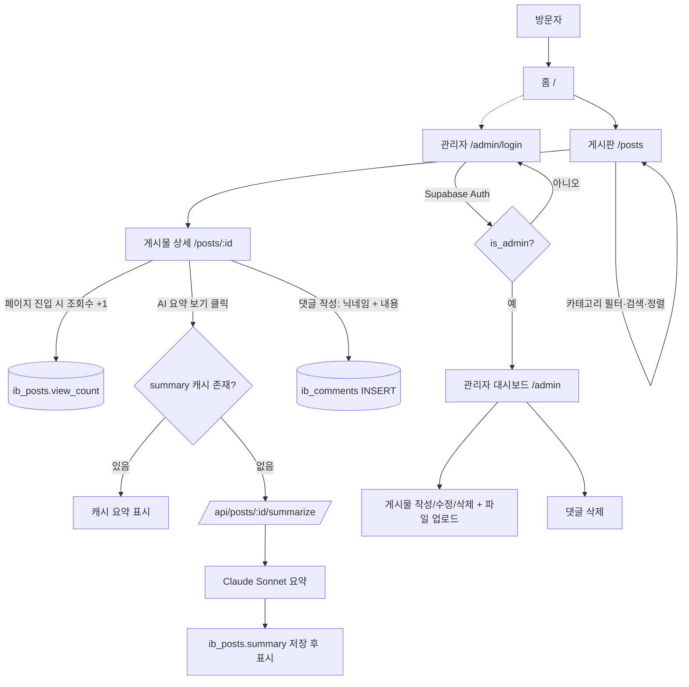
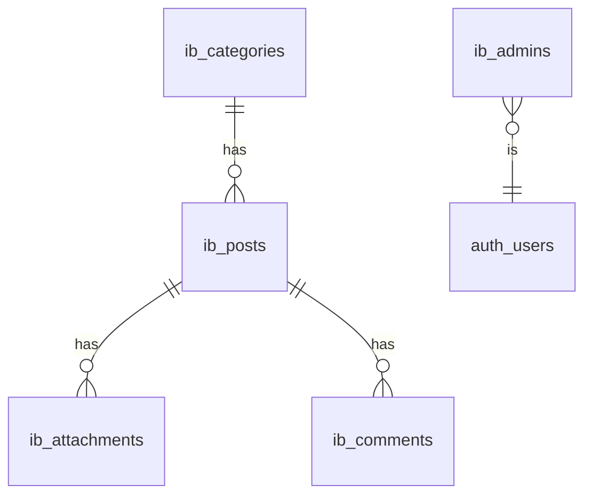

# Insurance Insights Board 웹 개발 설계서

> **버전**: v1.1
> **코드네임**: `insurance-insights` (프로젝트명은 변경 가능)
> **기술 스택**: Next.js 15 (App Router) · TweakCN (shadcn/ui) · Supabase · Anthropic Claude API
> **테이블 프리픽스**: `ib_`
> **Claude Code 핸드오프용 계획서**

### 변경 이력
| 버전 | 날짜 | 변경 내용 |
|------|------|----------|
| v1.0 | — | 최초 설계서 |
| v1.1 | 2026-06-09 | harness 적용. ① §5 에이전트 구조를 서브에이전트 → **에이전트 팀**(TeamCreate/SendMessage/TaskCreate 자체 조율)으로 전환 + QA 에이전트(`qa-integrator`) 추가. ② 프로젝트 위치를 현재 루트(`Actuarial_Platform/`)로 정정. ③ 부록 B 리뷰 항목 결정 확정. 하네스 산출물: `.claude/agents/`(5), `.claude/skills/`(3 + 오케스트레이터 1), `CLAUDE.md`. |
| v1.1a | 2026-06-09 | **DB 공존 요건 반영**: 기존 보험 뉴스 Supabase 프로젝트(`hkrxnkntapcychtbxpmv`)에 `ib_` 프리픽스로 additive 추가(기존 객체 무변경). 향후 합산 운영은 **분리 + 브리지 뷰**(`ib_feed_v`) 방식 채택 — 초안 `output/integration_bridge_view.draft.sql`, 가이드 `docs/domain/integration-news.md`. 현재는 미연결. |

---

## 1. 프로젝트 컨텍스트

### 목적
사용자가 작성한 **PDF 파일 및 텍스트 자료를 게시**하여 다수의 방문자에게 보험 관련 정보·분석을 제공하는 **공개 게시판형 정보 플랫폼**.

### 대상 사용자
| 구분 | 권한 | 회원가입 |
|------|------|---------|
| **일반 방문자** | 자료 열람, 검색, AI 요약 요청, 댓글 작성 | 불필요 (익명) |
| **관리자** | 자료 게시·수정·삭제, 파일 업로드, 댓글 삭제 | Supabase Auth 로그인 |

### 핵심 기능 요약
- 3개 카테고리별 자료 게시 및 카드형 목록 표시
- PDF/텍스트 파일 저장 및 인라인 열람(PDF.js) + 다운로드
- **AI 요약** (Claude Sonnet) — 사용자 요청 시 생성, 첫 생성 후 캐싱
- 검색 (제목 + 본문) 및 정렬 (최신순 기본 / 인기순)
- 조회수 카운트 (단순 누적)
- 일반 사용자 댓글 (단층, 닉네임 기반, 댓댓글 없음)
- 관리자 전용 콘텐츠 관리

### 콘텐츠 카테고리
| slug | 카테고리명 | 설명 |
|------|-----------|------|
| `exclusive-rights` | 보험 배타적 사용권 분석 | 신상품 배타적 사용권 관련 분석 자료 |
| `global` | 해외 주요 보험 정보·자료 | 해외 보험 시장·제도·연구 자료 분석 |
| `domestic` | 국내 보험 정보·분석 | 국내 보험 관련 정보 및 분석 |

> 카테고리는 `ib_categories` 테이블로 관리하여 추후 추가/변경 가능. v1.0은 위 3개로 시드.

### 제약조건
- **성능**: 카드 목록 페이지 Lighthouse Performance ≥ 90, 초기 로드 < 2.5s (LCP)
- **접근성**: WCAG AA 준수, 키보드 내비게이션, 명도 대비 4.5:1 이상
- **보안**: 익명 쓰기(댓글) 경로 RLS 제한, 관리자 작업은 인증 필수, 서비스 롤 키는 서버 전용
- **언어**: UI·콘텐츠 모두 한국어
- **AI 비용**: 요약은 on-demand + 캐싱으로 중복 호출 차단

### 용어 정의
| 용어 | 정의 |
|------|------|
| **배타적 사용권** | 보험 신상품 개발사가 일정 기간 동일 상품 판매를 독점하는 권리 |
| **게시물(Post)** | 카테고리에 속한 단위 자료. 제목·본문·첨부파일(PDF 등)·요약·조회수·댓글로 구성 |
| **AI 요약** | 게시물 본문 + 첨부 PDF 추출 텍스트를 Claude Sonnet으로 요약한 결과 (캐싱됨) |

---

## 2. 페이지 목록 및 사용자 흐름

### 페이지 목록
| 경로 | 페이지명 | 설명 | 인증 |
|------|---------|------|------|
| `/` | 홈/랜딩 | 풀뷰포트 히어로 + 카테고리별 대표 카드 미리보기 | 불필요 |
| `/posts` | 게시판 목록 | 카드 그리드 · 카테고리 필터 · 검색 · 정렬 | 불필요 |
| `/posts/[id]` | 게시물 상세 | PDF 뷰어 · 본문 · AI 요약 · 댓글 · 조회수 +1 | 불필요 |
| `/admin/login` | 관리자 로그인 | Supabase Auth 이메일/비밀번호 | 불필요(진입) |
| `/admin` | 관리자 대시보드 | 게시물 목록 관리 · 댓글 관리 | **필요** |
| `/admin/posts/new` | 게시물 작성 | 제목·본문·카테고리·파일 업로드 | **필요** |
| `/admin/posts/[id]/edit` | 게시물 수정 | 기존 게시물 편집 | **필요** |

### 사용자 흐름 다이어그램


### 인증/권한 분기 조건
- `/admin/*` (단, `/admin/login` 제외)는 **middleware**에서 세션 확인 → 비인증 시 `/admin/login` 리다이렉트
- 세션 보유 시 `ib_admins` 테이블 대조 → 관리자 아니면 접근 거부
- 모든 쓰기 작업(게시물 CUD, 파일 업로드, 댓글 삭제)은 **서버 측에서 재검증** (RLS + Route Handler 이중)

### 데이터 흐름 (입력 → 처리 → 저장 → 표시)
| 단계 | 게시물 등록 | AI 요약 | 댓글 | 조회수 |
|------|-----------|--------|------|-------|
| 입력 | 관리자 폼(제목·본문·파일) | 사용자 "요약 보기" 클릭 | 익명 닉네임+내용 | 상세 페이지 진입 |
| 처리 | 파일 → Storage 업로드, 메타 → DB | PDF 텍스트 추출 → Sonnet 호출 | 길이/금칙어 검증 | RPC 호출 |
| 저장 | `ib_posts` + `ib_attachments` | `ib_posts.summary` 캐싱 | `ib_comments` INSERT | `view_count += 1` |
| 표시 | 카드/상세 | 요약 패널 | 댓글 리스트 | 카드/상세 메타 |

### LLM 판단 영역 vs 코드 처리 영역
| Claude(LLM)가 수행 | 코드/스크립트가 처리 |
|---------------------|---------------------|
| 자료 본문·PDF의 핵심 내용 요약 | PDF 텍스트 추출 (pdf-parse) |
| 요약문 한국어 자연스러움·구조화 | Storage 업/다운로드, DB CRUD |
| (구현 시) 컴포넌트 구조·디자인 결정 | 조회수 증가 RPC, 검색 쿼리, 정렬 |

### 성공 기준 / 검증 / 실패 처리 (구현 단계별)
| 단계 | 성공 기준 | 검증 방법 | 실패 시 처리 |
|------|----------|----------|------------|
| DB·RLS 구축 | 익명 SELECT·INSERT(댓글) 통과, UPDATE/DELETE 차단 | 규칙 기반 (RLS 테스트 쿼리) | 자동 재시도 (정책 재작성) |
| 파일 업/다운 | PDF 업로드·인라인 렌더·다운로드 정상 | 사람 검토 (브라우저 렌더) | 폴백 UI (뷰어 실패 시 다운로드 링크) |
| AI 요약 | 캐시 미스 시 생성, 히트 시 재호출 0 | 타입/스키마 검증 + 사람 검토 | 에스컬레이션 (추출 실패 PDF는 본문만 요약) |
| 검색·정렬 | 키워드·인기순 정확 동작 | 규칙 기반 (테스트 케이스) | 자동 재시도 |
| UI(Tesla 톤) | 그림자 0, 토큰 색상 일치, 0.33s 트랜지션 | LLM 자기검증 + 사람 검토 | 에스컬레이션 (디자인 모호 시 확인) |
| 빌드/타입 | TS 오류 0, 빌드 성공, Lighthouse ≥ 90 | 규칙 기반 | 자동 재시도 (최대 3회) |

---

## 3. 데이터 모델 (Supabase)

### 테이블 목록
| 테이블명 | 설명 | RLS | 실시간 |
|---------|------|-----|-------|
| `ib_categories` | 카테고리 마스터 | ✅ | — |
| `ib_posts` | 게시물 (요약·조회수 포함) | ✅ | — |
| `ib_attachments` | 게시물 첨부파일(PDF 등) 메타 | ✅ | — |
| `ib_comments` | 익명 댓글 (단층) | ✅ | 선택 |
| `ib_admins` | 관리자 식별 (auth.users 연결) | ✅ | — |

### 컬럼 개요
**`ib_categories`**
| 컬럼 | 타입 | 비고 |
|------|------|------|
| id | uuid PK | |
| slug | text unique | URL 식별자 |
| name | text | 표시명 |
| description | text | |
| sort_order | int | 노출 순서 |
| created_at | timestamptz | |

**`ib_posts`**
| 컬럼 | 타입 | 비고 |
|------|------|------|
| id | uuid PK | |
| category_id | uuid FK → ib_categories | |
| title | text | |
| content | text | 본문(마크다운/플레인) |
| summary | text nullable | AI 요약 캐시 |
| summary_generated_at | timestamptz nullable | 캐시 시각 |
| view_count | int default 0 | 단순 누적 |
| author_name | text nullable | 작성 관리자 표시명 |
| is_published | bool default true | 비공개 초안 지원 |
| created_at / updated_at | timestamptz | |

**`ib_attachments`**
| 컬럼 | 타입 | 비고 |
|------|------|------|
| id | uuid PK | |
| post_id | uuid FK → ib_posts | |
| file_name | text | 원본 파일명 |
| storage_path | text | 버킷 내 경로 |
| mime_type | text | application/pdf 등 |
| file_size | bigint | bytes |
| created_at | timestamptz | |

**`ib_comments`** (비밀번호 컬럼 없음 — 삭제는 관리자 전용)
| 컬럼 | 타입 | 비고 |
|------|------|------|
| id | uuid PK | |
| post_id | uuid FK → ib_posts | |
| nickname | text | 익명 표시명 |
| content | text | |
| created_at | timestamptz | |

**`ib_admins`**
| 컬럼 | 타입 | 비고 |
|------|------|------|
| user_id | uuid PK → auth.users | |
| email | text | |
| created_at | timestamptz | |

### 주요 관계 (ERD)


### RLS 정책 개요
| 테이블 | SELECT | INSERT | UPDATE | DELETE |
|--------|--------|--------|--------|--------|
| `ib_categories` | 전체 공개 | 관리자 | 관리자 | 관리자 |
| `ib_posts` | `is_published=true` 공개 / 관리자 전체 | 관리자 | 관리자 | 관리자 |
| `ib_attachments` | 공개 | 관리자 | 관리자 | 관리자 |
| `ib_comments` | 전체 공개 | **익명 허용** | 금지 | 관리자만 |
| `ib_admins` | 관리자 | 금지(시드/수동) | 금지 | 금지 |

- **조회수 증가**: 익명에게 `ib_posts` UPDATE 권한을 주지 않기 위해 `SECURITY DEFINER` RPC `ib_increment_view(post_id)`로 처리
- **관리자 판별 함수**: `ib_is_admin()` → `auth.uid() in (select user_id from ib_admins)`

> ⚠️ **보안 검토 항목**: 익명 댓글 INSERT는 스팸에 노출됨. v1.0은 길이 제한 + 서버 측 rate limit(IP 기준)만 적용하고, CAPTCHA/금칙어 필터는 v2.0 이연으로 명시.

### Supabase Auth
- 관리자 전용. 이메일/비밀번호 방식. 공개 회원가입 비활성화(대시보드에서 OFF)
- 관리자 계정은 수동 생성 후 `ib_admins`에 시드
- 세션: `@supabase/ssr` 쿠키 기반, middleware에서 갱신

### Storage
- 버킷 `ib-attachments` (public read)
- 경로 규칙: `{category_slug}/{post_id}/{filename}`
- 업로드: 관리자 + 서비스 롤(서버 Route Handler), 다운로드: 공개

---

## 4. UI/UX 방향 (Tesla 기반 미니멀/에디토리얼)

### 디자인 톤 및 근거
**미니멀/에디토리얼** — 콘텐츠 중심 정보 게시판이므로 "자료가 곧 주인공"이라는 Tesla의 철학(급진적 절제, 사진/콘텐츠 우선, UI 크롬 최소화)이 직접 부합. 그림자·그라데이션·테두리·패턴 없이 **여백과 타이포그래피만으로 위계**를 만든다.

> **설계상 긴장과 해소**: Tesla는 시네마틱 제품 사진이 감정적 무게를 짊어진다. 본 게시판은 사진 대신 **텍스트/PDF 자료**가 콘텐츠다. 따라서 "사진 우선" 원칙을 **여백·타이포·정제된 카드**로 치환한다. 카드 썸네일은 (a) PDF 첫 페이지 자동 렌더 또는 (b) 카테고리별 모노크롬 커버 중 택1 — v1.0은 (b) 모노크롬 커버 + 본문 발췌 기본, (a)는 선택 구현.

### 컬러 토큰 (Tesla 팔레트 그대로)
| 토큰 | 값 | 역할 |
|------|----|------|
| `--primary` | `#3E6AE1` | 유일한 강조색 · 주요 CTA |
| `--background` | `#FFFFFF` | 기본 배경 |
| `--surface-alt` | `#F4F4F4` | 섹션 구분용 보조 표면 |
| `--foreground` | `#171A20` | 제목·내비 텍스트 (Carbon Dark) |
| `--text-body` | `#393C41` | 본문 (Graphite) |
| `--text-tertiary` | `#5C5E62` | 보조 링크·메타 (Pewter) |
| `--placeholder` | `#8E8E8E` | 입력 placeholder (Silver Fog) |
| `--border` | `#EEEEEE` | 구분선 (Cloud Gray) |
| `--dark-surface` | `#171A20` | 다크 오버레이/히어로 텍스트 영역 |

- **그라데이션·세만틱 색상 없음**. 강조는 오직 `--primary`.

### 타이포그래피
| 역할 | 크기 | weight | 비고 |
|------|------|--------|------|
| 히어로 타이틀 | 40px | 500 | Display 스케일 |
| 게시물 제목(상세) | 28–32px | 500 | |
| 카드 제목 | 17px | 500 | |
| 내비/버튼 | 14px | 500 | |
| 본문 | 14–16px | 400 | line-height 1.43 |
| 메타·보조 | 14px | 400 | Pewter |

> **폰트 결정**: Tesla의 Universal Sans는 독점 폰트이므로 한국어 콘텐츠에 맞춰 **Pretendard**(기하학적 산세리프, 한글 최적)를 본문/UI에, **Inter**를 라틴 폴백으로 사용. weight는 400/500만 사용(700·300 금지), letter-spacing normal, 대문자 변환 없음.

### TweakCN 커스터마이징 대상
| 컴포넌트 | 커스터마이징 방향 |
|---------|------------------|
| `Button` | border-radius 4px, weight 500, primary=`#3E6AE1`/secondary=white, **그림자 제거**, 트랜지션 `color/background/border 0.33s` |
| `Card` | 그림자·테두리 제거, 클린 화이트 표면. 이미지 커버형 카드는 radius 12px + overflow hidden |
| `Input` / `Textarea` | 투명 배경, placeholder `#8E8E8E`, 최소 테두리 |
| `Tabs` / `Badge` | 카테고리 필터·라벨용, 모노크롬 |
| `Dialog` / `Sheet` | 관리자 폼·삭제 확인. 오버레이 `rgba(128,128,128,0.65)` |
| `Select` | 정렬·카테고리 선택 |
| `Skeleton` | 카드/요약 로딩 상태 |

- 토큰 시스템은 `app/globals.css`의 CSS 변수로 주입, shadcn 테마 변수와 매핑

### 핵심 컴포넌트 목록 및 역할
| 컴포넌트 | 역할 |
|---------|------|
| `HeroSection` | 홈 풀뷰포트 히어로(타이틀 + 게시판 진입 CTA) |
| `PostCard` | 카드형 게시물 미리보기 (카테고리·제목·발췌·조회수·날짜) |
| `PostGrid` | 반응형 카드 그리드 |
| `CategoryTabs` | 카테고리 필터 |
| `SearchBar` | 제목·본문 검색 입력 |
| `SortSelect` | 최신순 / 인기순 |
| `PdfViewer` | PDF.js 인라인 뷰어 + 다운로드 버튼 (폴백: 다운로드 링크) |
| `SummaryPanel` | AI 요약 표시 + "요약 보기" 트리거 + 로딩 |
| `CommentSection` | 단층 댓글 목록 + 작성 폼(닉네임·내용) |
| `AdminPostForm` | 게시물 작성/수정 폼 + 파일 업로드 |
| `SiteNav` | 화이트/프로스트 글래스 내비, 그림자 없음, sticky |

### 반응형 브레이크포인트 전략
| 구간 | 폭 | 카드 그리드 | 내비 |
|------|----|-----------|------|
| Mobile | <768 | 1열, 카드 풀폭, CTA 세로 스택 | 햄버거 |
| Tablet | 768–1024 | 2열 | 축약 |
| Desktop | 1024–1440 | 3열 | 수평 풀 |
| Large | >1440 | 3열 + max-width 컨테이너 | 중앙 정렬 |

### 애니메이션·인터랙션 방향
- 모든 상태 전환 **0.33s cubic-bezier**, **색상 트랜지션만** (scale/translate 금지)
- 카드 hover: 미세한 배경/테두리 변화만, 그림자·확대 없음
- 히어로/섹션: "한 화면에 한 메시지", 갤러리형 스크롤

---

## 5. 구현 스펙

### 폴더 구조 (Next.js 15 App Router)
> v1.1: 프로젝트 루트는 현재 작업 폴더 `Actuarial_Platform/`. 하네스(`.claude/`, `CLAUDE.md`)와 앱을 이 루트에 직접 구성한다.
```
/ (Actuarial_Platform 루트)
  ├── CLAUDE.md
  ├── .claude/
  │   ├── skills/
  │   │   ├── tweakcn-tesla-theme/        (SKILL.md, scripts/, references/)
  │   │   ├── pdf-text-extract/           (SKILL.md, scripts/)
  │   │   ├── supabase-rls/               (SKILL.md, references/)
  │   │   └── insurance-board-builder/    (SKILL.md — 오케스트레이터)
  │   └── agents/
  │       ├── db-architect.md
  │       ├── api-designer.md
  │       ├── ui-builder.md
  │       ├── ai-summarizer.md
  │       └── qa-integrator.md
  ├── app/
  │   ├── (public)/
  │   │   ├── page.tsx                # 홈
  │   │   ├── posts/page.tsx          # 게시판 목록
  │   │   └── posts/[id]/page.tsx     # 상세
  │   ├── (admin)/
  │   │   └── admin/
  │   │       ├── login/page.tsx
  │   │       ├── page.tsx            # 대시보드
  │   │       └── posts/new/page.tsx
  │   │       └── posts/[id]/edit/page.tsx
  │   ├── api/
  │   │   ├── posts/[id]/summarize/route.ts
  │   │   ├── posts/[id]/view/route.ts
  │   │   ├── comments/route.ts
  │   │   └── upload/route.ts
  │   ├── layout.tsx
  │   └── globals.css                 # Tesla 토큰
  ├── components/
  │   ├── ui/                         # TweakCN 컴포넌트
  │   └── feature/                    # PostCard, PdfViewer, SummaryPanel ...
  ├── lib/
  │   ├── supabase/                   # client, server, middleware
  │   └── utils/
  ├── types/
  ├── output/                         # 에이전트 중간 산출물
  ├── middleware.ts                   # 관리자 라우트 보호
  └── docs/
      ├── references/                 # Tesla 디자인 시스템 문서
      └── domain/                     # schema.md(ERD), 보험 용어
```

### CLAUDE.md 핵심 섹션 목록 (내용은 구현 시 작성)
1. 프로젝트 개요 및 기술 스택
2. 디자인 시스템 규칙 (Tesla 토큰·금지사항)
3. Supabase 연결·RLS 원칙
4. 서브에이전트 오케스트레이션 규칙
5. 검증·실패 처리 패턴
6. 환경 변수 및 시크릿 취급 규칙

### 에이전트 구조 (v1.1: 에이전트 팀)
**에이전트 팀** — 페이지·역할이 구분되고 도메인(DB/API/UI/AI)이 분리되지만, DB→API→UI 의존성 조율과 경계면(API↔프론트) 교차 검증이 품질을 좌우하므로 harness 기본값인 **에이전트 팀**으로 구성한다. 오케스트레이터 스킬(`insurance-board-builder`)이 리더로서 `TeamCreate`로 팀을 만들고, 팀원은 `SendMessage`(직접 통신)와 `TaskCreate`/`TaskUpdate`(공유 작업 목록)로 **자체 조율**한다. (v1.0의 "서브에이전트 직접 호출 금지" 방침은 팀 통신으로 대체됨.)

데이터 전달: **파일 기반(`output/`, `_workspace/`) + 태스크 기반(조율) + 메시지 기반(실시간)** 혼합.

| 팀원 | 타입 | 역할 | 사용 스킬 | 출력 |
|------|------|------|----------|------|
| `db-architect` | general-purpose | 테이블·RLS·SECURITY DEFINER RPC·Storage 정책·시드 | `supabase-rls` | `output/schema.sql`, `output/seed.sql`, `output/rls_tests.sql` |
| `api-designer` | general-purpose | Route Handler·Server Action·`middleware.ts` 관리자 보호 | — | `output/api_contract.json` + 코드 |
| `ui-builder` | general-purpose | 페이지·컴포넌트·TweakCN 커스터마이징 | `tweakcn-tesla-theme` | 컴포넌트 (props 인라인) |
| `ai-summarizer` | general-purpose | 요약 파이프라인(추출→Sonnet→캐싱) | `pdf-text-extract` | 요약 로직 |
| `qa-integrator` | general-purpose | 경계면 교차 검증(API 응답 shape↔프론트 훅)·RLS 테스트·모듈별 점진적 QA | — | QA 리포트 |

> 모든 에이전트는 `.claude/agents/{name}.md`로 정의하고 `model: "opus"`로 호출한다. QA는 검증 스크립트 실행이 필요하므로 `Explore`(읽기전용)가 아닌 `general-purpose`를 사용한다.

### 페이지·컴포넌트별 처리 방식
| 작업 | 처리 |
|------|------|
| 보일러플레이트·CRUD 스캐폴딩 | 스크립트/코드 |
| 마이그레이션 실행 | 스크립트 (db-architect) |
| 컴포넌트 구조·디자인 결정 | 에이전트(ui-builder) 판단 |
| 요약 프롬프트 설계 | 에이전트(ai-summarizer) 판단 |

### 스킬 목록
| 스킬명 | 역할 | 트리거 조건 |
|-------|------|-----------|
| `tweakcn-tesla-theme` | Tesla 토큰 → globals.css/shadcn 변수 생성 | 테마 초기화·색상 변경 시 |
| `pdf-text-extract` | 업로드 PDF에서 텍스트 추출(요약 입력용) | 요약 요청·업로드 시 |
| `supabase-rls` | RLS 정책·SECURITY DEFINER RPC 템플릿 | 정책 작성·검토 시 |

### 데이터 전달 패턴
- 스키마·API 계약 등 구조화된 큰 산출물 → `/output/*.json|sql` 파일 경로 전달
- 컴포넌트 props·짧은 설정값 → 프롬프트 인라인

### 환경 변수
| 변수명 | 용도 |
|--------|------|
| `NEXT_PUBLIC_SUPABASE_URL` | Supabase 프로젝트 URL |
| `NEXT_PUBLIC_SUPABASE_ANON_KEY` | Supabase 공개(anon) 키 |
| `SUPABASE_SERVICE_ROLE_KEY` | 서버 전용 — 파일 업로드·관리 작업 |
| `ANTHROPIC_API_KEY` | Claude Sonnet 요약 호출 (서버 전용) |
| `NEXT_PUBLIC_SITE_URL` | 절대 URL 생성용 (선택) |

> 시크릿(`SERVICE_ROLE_KEY`, `ANTHROPIC_API_KEY`)은 **서버(Route Handler/Server Action)에서만** 사용. 클라이언트 노출 금지.

### 주요 산출물 파일 형식
- 게시물 첨부: PDF(주), 그 외 파일 일반 저장 (Storage)
- 요약: 텍스트(DB 컬럼 캐싱)
- 마이그레이션: `.sql`

---

## 6. 참고 자료
- **디자인 레퍼런스**: Tesla Design System (본 설계서 첨부 사양) → `/docs/references/tesla-design-system.md`
- **도메인 지식**: 보험 배타적 사용권 / 해외·국내 보험 자료 분류 기준 → `/docs/domain/`
- **API 문서**: Anthropic Messages API (요약), Supabase (Auth·Storage·RLS), PDF.js
- **스키마 문서**: `/docs/domain/schema.md` (ERD)

---

## 부록 A. v2.0 이연 기능
v1.0 범위를 깨끗이 유지하기 위해 아래는 의도적으로 이연:
- **요약 배치 사전 생성**(크론잡) — 인기 글 사전 캐싱
- **댓글 스팸 방지** — CAPTCHA·금칙어 필터·강화된 rate limit
- **반응/북마크** — 좋아요, 스크랩
- **이메일 구독** — 신규 자료 알림(Resend)
- **전문 검색(FTS)** — tsvector + 한국어 형태소(ilike → FTS 업그레이드)
- **카테고리 관리 UI** — 관리자가 카테고리 추가/편집
- **다중 관리자 역할** — 편집자/검수자 권한 분리
- **사용자 제출** — 외부 자료 제보
- **분석 대시보드** — 조회·검색 통계

## 부록 B. 리뷰 확인 항목 (v1.1 결정 확정)
- [x] **관리자 댓글 관리 화면 위치** → `/admin` 대시보드 내 탭으로 통합
- [x] **`ib_posts`/`ib_attachments` 스키마 커버리지** → PDF를 주 첨부로, 그 외 일반 파일도 Storage 일반 저장으로 커버. v1.0 스키마 유지
- [x] **PdfViewer 범위** → 인라인(PDF.js) + 다운로드 버튼, 렌더 실패 시 다운로드 링크 폴백 (설계 명시안 확정)
- [x] **카드 썸네일** → (b) 카테고리별 모노크롬 커버 + 본문 발췌 기본. (a) PDF 첫 페이지 렌더는 선택 구현으로 이연
- [x] **익명 댓글 rate limit** → v1.0은 길이 제한 + IP 기준 서버 rate limit 최소안. CAPTCHA·금칙어는 v2.0 이연
